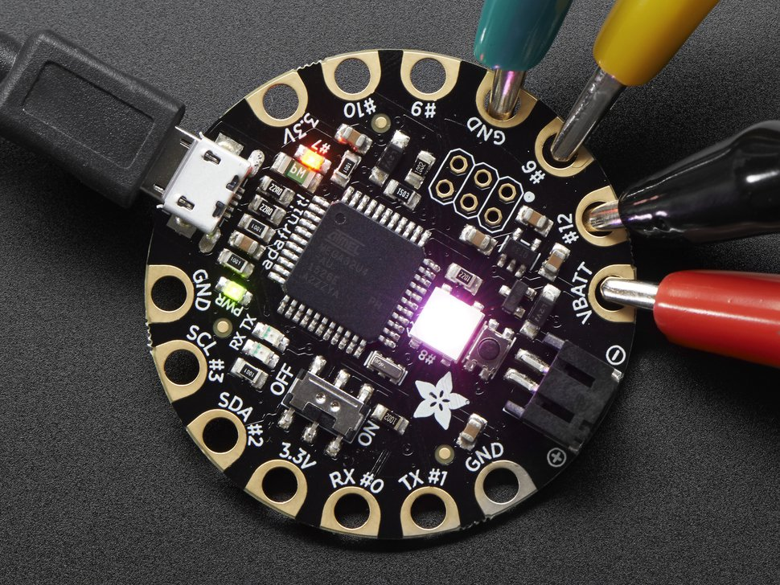
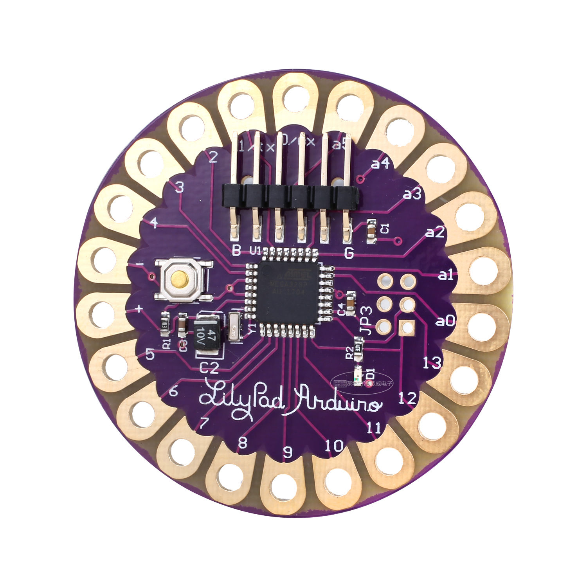
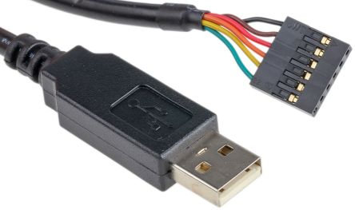
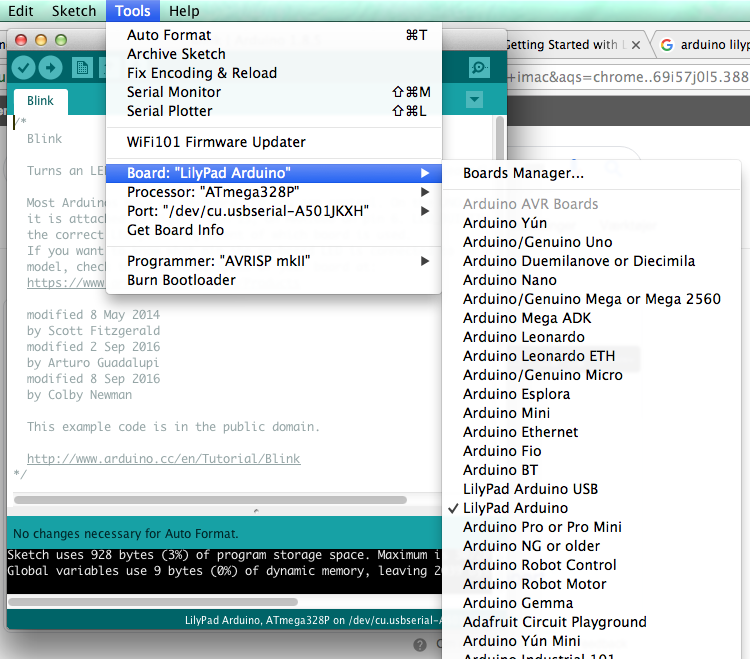
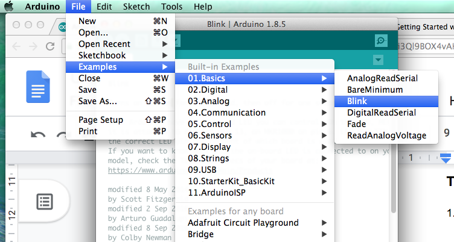
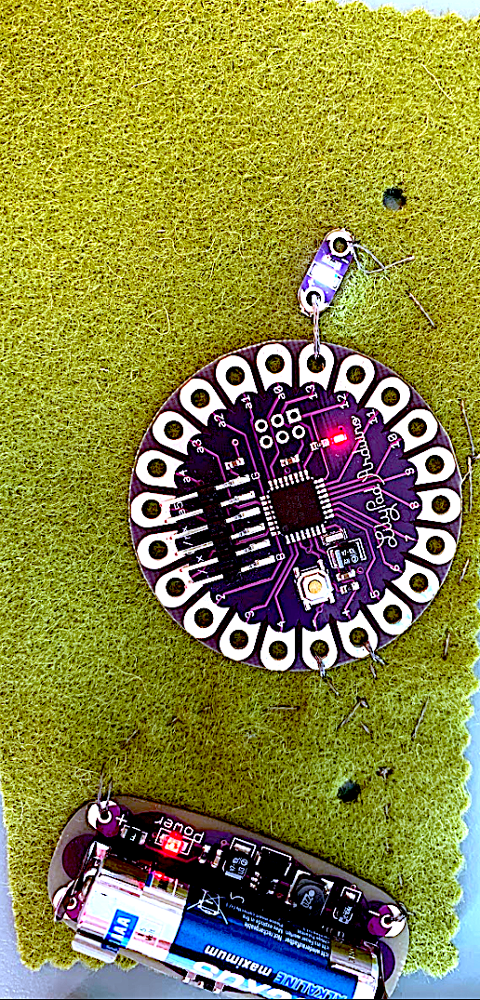
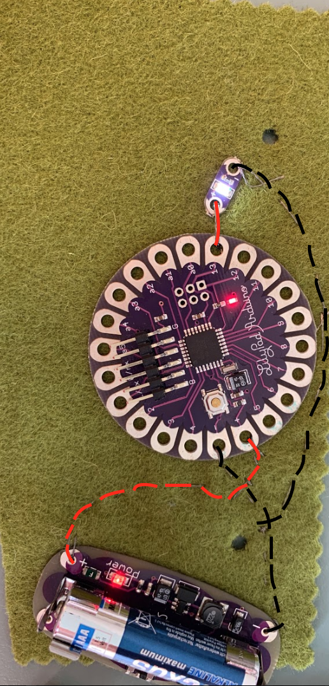
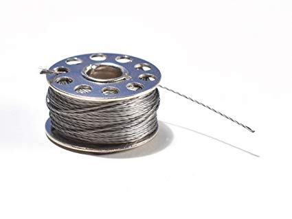

# LilyPad-Wearables

### LilyPads der findes i labbet:

(Navn i Arduino program “LilyPad Arduino USB”)

(Navn i Arduino program “LilyPad Arduino”)

### Tilslut boardet: 

1.  Tilslut USB til boardet, 
→ ved “LilyPad USB” tilsluttes USB-stik
→ ved “LilyPad” tisluttesl FTDI kabel, som ser således ud: 

2. Vælg det rigtige board i “Arduino” programmet: 

	Tools → boards → Vælg det rigtige board!
  

3. Test at boardet er sluttet korrekt til ved at vælge kode-eksemplet “blink”, overfør til board og tjek om LED’en på      boardet blinker! 

Boardet fungerer på samme måde som et almindeligt arduino uno board. I stedet for ledninger bruges dog sytråd til at forbinde komponenter. Til prototyper og test af kredsløb kan krokodillenæb bruges! 

### Eksempel på opsætning med LED: 

 

Her er conductive(ledende) tråd brugt, som ses på billedet nedenfor! 

#### Tips til brug af conductive thread: 

1. Sørg for at få tråden gennem hullerne på komponenterne flere gange, så forbindelsen bliver sikker! 

2. Lav almindelige jævnlige sting over til det sted de pågældende komponenter skal forbindes. Eksempelvis mellem plus på batteri forsyningen, og hen til plus på LilyPad boardet. 

3. Tråde der leder til forskellige ting kan godt krydse hinanden, men sørg da for at den ene tråd er under stoffet, og den anden over. Som det ses på billedet ovenfor hvor 
den røde og den sorte tråd krydser hinanden. 
